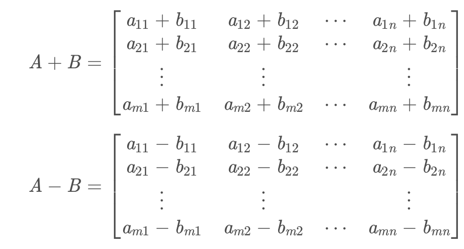
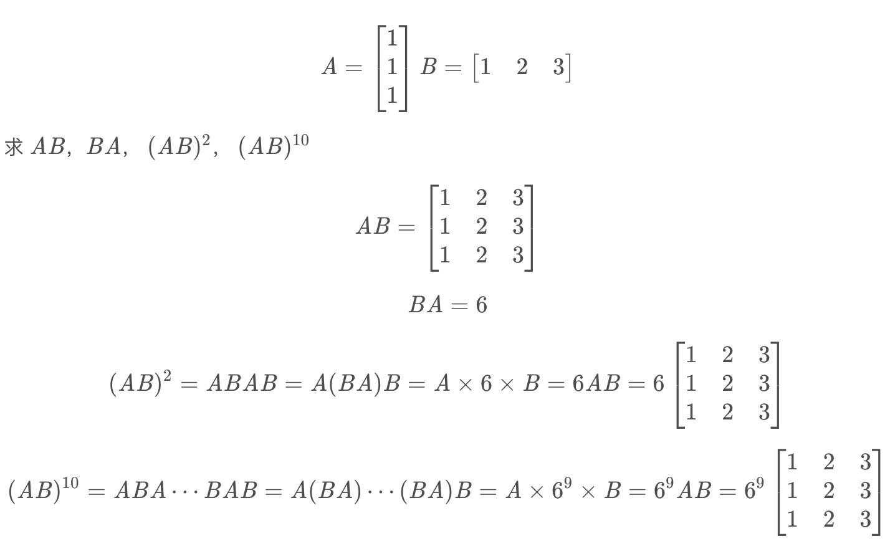

# 线性代数

## 矩阵的学习

### 矩阵的定义

m*n个数，构成的m行，n列的数表

$$
\left[ 
 \begin{matrix} 
  a11 & a12 & a13 & \cdots & a1n\\ 
  a21 & a22 & a23 & \cdots & a2n \\ 
  \vdots & \vdots & \vdots & \vdots & \vdots \\ 
  am1 & am2 & am3 & \cdots & amn 
 \end{matrix} 
\right]
$$

#### 矩阵分类

* 实矩阵和复矩阵
  
    实矩阵：全是实数的矩阵

    复矩阵：元素是复数的矩阵

* 零矩阵

    元素全为零的矩阵

    $$
    \left[
     \begin{matrix}
      0 & 0 & 0 & \cdots & 0 \\
      0 & 0 & 0 & \cdots & 0 \\
      0 & 0 & 0 & \cdots & 0 \\
      \vdots & \vdots & \vdots & \vdots & \vdots\\
      0 & 0 & 0 & \cdots & 0 
     \end{matrix}
    \right]
    $$

* 方矩阵

    行数与列数相等的矩阵

* 单位矩阵

    对角线为1，其余为0的矩阵

* 同型矩阵

    两个矩阵的行数和列数相等的矩阵

#### 矩阵的运算

* 矩阵的加减法

    只有同型矩阵才能加减

加减法满足交换律和结合律

* 矩阵的乘法

